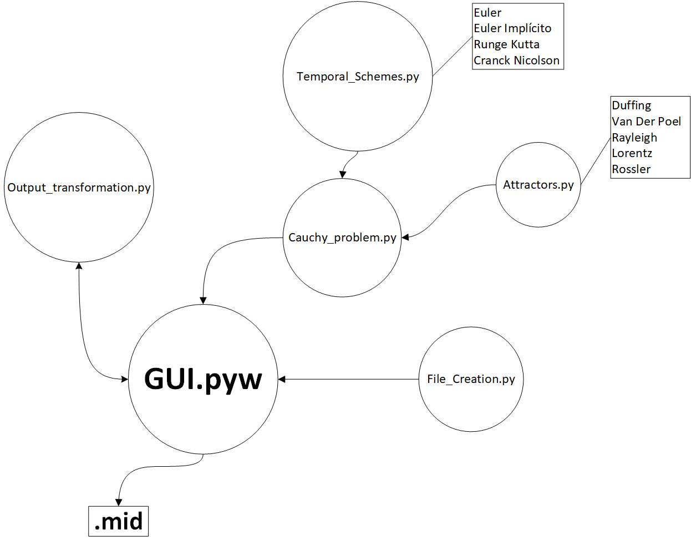

# AM1_orbits
This repository contains all the projects carried out for the course of Advanced Mathematics I.
It is based on orbits analysis with finite differences problems, which are to be integrated with
different temporal schemes in order to solve the Cauchy Problem.

List of the milestones: 
1. Cauchy problem Integration without functions nor modules. 
2. Cauchy problem Integration with functions and modules. 
3. Estimation of order for several different temporal schemes and error analysis.       
4. Regions of stability for different temporal schemes and application to Kepler problem.
5. N-bodies problem integration.
6. Orbits around Lagrange points.

Files in the modules folder have been used in milestones and contain temporal schemes, Cauchy problem
solving functions and functions for stability regions calculations.

Contents of Hito 7 (Milestone 7) with the different modules and their structure  

